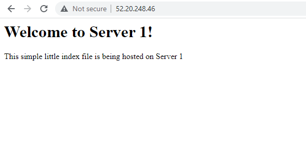
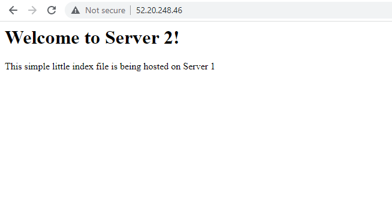

Part 2 - Setup Load Balancing

1: The /etc/hosts will basically let you configure your hostname and associate that name to your instance. This will let you ssh into
your instnace with for example webserv1, rather than ubuntu@10.0.0.1. 

2: This process surprisingly gave me some headaches. Anyway, I ended up coping my private keys over to my all my intances, changed
permissions, then let gave the path to the private to be able to ssh into another private IP.

3: To setup up the haproxy, I had to go into /etc/haproxy and then create a backup for the config file, just to be safe if I messed up
the file. But I sudo vim the cfg file and then added my public IP and bind with the private IP of the instance. Then added the backend
in which added the balance, the option httpchk, and finally server webserv1 and server webserv2! The frontend and backend had to be added, because they only giving you the error message redirects.The resources used were the index.html files, I think this is what you are 
getting at, if not I used the haproxy website givin in the project description for a resource. I also used sudo systemctl restart haproxy to restart the haproxy!

4: For both servers I had to configure the index.html file which was in the path /var/html/index.html. I used the html template provided in in the project description. There were no configuartions, beside it was just the default page and replaced with the template. The path was /var/html/index.html, because this is the default path apache implements the index files. To restart you could use systemctl restart apache2. The main resource used was the default index.html telling me the path of where to edit and replace the files. The big help was using your templates and online recorded videos.

5:  
   

